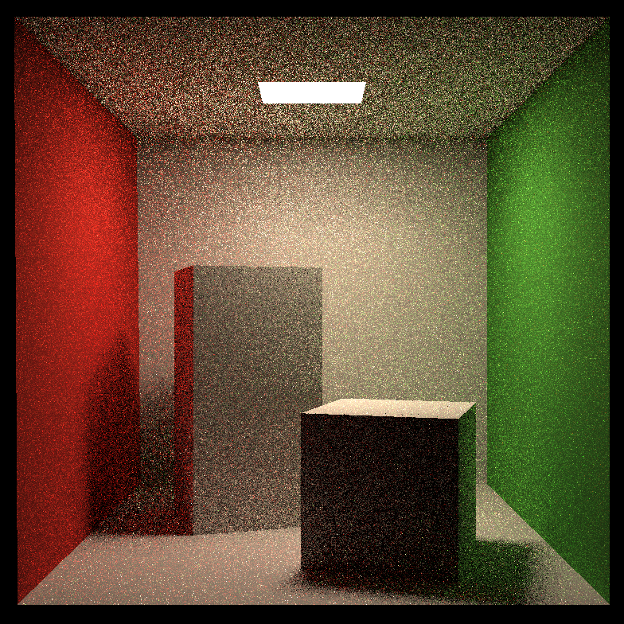

# GAMES101-Homework
GAMES101课程作业合集，将完成并上传到github

## 作业生成图像

### 2

未使用SSAA优化

使用SSAA优化

### 3

法向量

bling-phong光照模型

光照+材质

法线贴图

法线贴图并应用材质

更改模型并使用光照的rock渲染

### 4

### 5

### 6

### 7

手写多线程加速，最大线程数为12，为本机最大逻辑cpu数量

4ssp密度下的渲染图

用时:91 seconds

16ssp密度下的渲染图

用时:90 seconds

128ssp密度下的渲染图

用时:105 seconds

1024ssp密度下的渲染图

用时:567 seconds

1024sspSSAA

用时:1627 seconds

